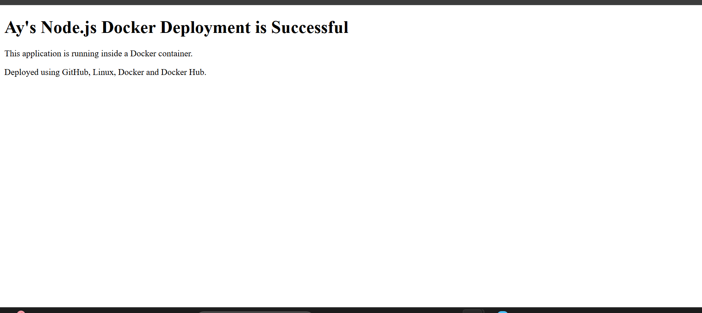

# Node.js Docker Application

## Project Overview

This project demonstrates the deployment of a simple Node.js application using GitHub, Linux, Docker, and Docker Hub.

The application runs inside a Docker container and is exposed on port 3000.

## Technologies Used

* Node.js
* Docker
* Docker Hub
* GitHub
* Linux / Ubuntu
* AWS EC2

## Project Files

* `app.js` — Node.js application
* `package.json` — Node.js project configuration
* `Dockerfile` — Instructions for building the Docker image
* `Screenshots/` — Deployment screenshots

## Docker Image

Docker Hub repository:

`ayodejare/nodejs-app`

Image tag:

`ayodejare/nodejs-app:1.0`

## Deployment Steps

### 1. Build the Docker Image

The Docker image was built using:

```bash
docker build -t ayodejare/nodejs-app:1.0 .
```


### 2. Push Image to Docker Hub

The image was tagged as:

```text
ayodejare/nodejs-app:1.0
```

The image was then pushed to Docker Hub.


### 3. Run the Docker Container

The container was started using:

```bash
docker run -d -p 3000:3000 ayodejare/nodejs-app:1.0
```

The running container was verified with:

```bash
docker ps
```


### 4. Access the Application

The application was accessed through:

```text
http://<EC2-PUBLIC-IP>:3000
```

The application displayed the successful Docker deployment message.



## Conclusion

The Node.js application was successfully containerized using Docker, pushed to Docker Hub, pulled and run on an Ubuntu AWS EC2 instance, and accessed through port 3000.
